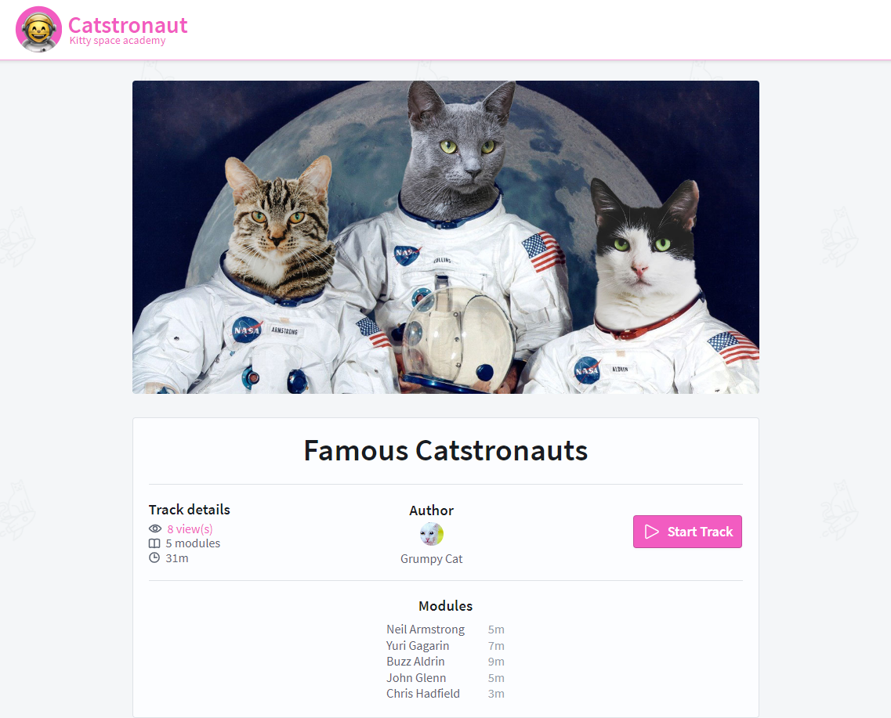

# Catstranauts Arguments 🚀

Welcome to my Catstranauts 👨‍🚀 Arguments Repo! This repo contains GraphQL client and server that allows you to fetch queries using argument, hence the name of the repo *arguments*. This was part of a [course](https://odyssey.apollographql.com/lift-off-part3) I did on Apollo's learning platform.

You can [preview the completed demo app here](https://lift-off-client-demo.netlify.app/).

## How to use this repo

The course will walk you step by step on how to implement the features you see in the demo app. This codebase is the starting point of your journey!

There are 2 main folders:

- `server`: The starting point of our GraphQL server.
- `client`: The starting point of our React application.of the steps and code completed!

To get started:

1. Navigate to the `server` folder.
2. Run `npm install`.
3. Run `npm start`.

This will start the GraphQL API server.

In another Terminal window,

1. Navigate to the `client` folder.
1. Run `npm install`.
1. Run `npm start`.

This will open up `localhost:3000` in your web browser.